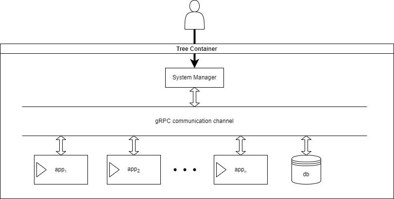

# Software Design Documentation

## High-level Block Diagram
This section completes the issue #3.

## Microservices
This section completes the issue #4 by describing the system microservices with initial details of their objectives and responsabilities.

- Manager
    - controls the data flow and the sytem itself, by being a proxy to the other services (docker containers)
- System Monitor
    - responsible to track and collect the system metrics
    - collects the following info:
        - cpu usage
        - memory usage
        - disk usage
- Database
    - manage data storage and retrieval
    - features a backup system
    - store; remove; retrieve; clean data
    - cleaning method to remove old data
- Cloud Service
    - responsible to push data to a cloud service, e.g., google cloud or AWS services
    - responsible to encrypt the retrieve data from the data base using TLS/SSL before pushing the data
    - check internet connection and availability
    - accepts:
        - eth
        - wifi
        - modem (future implementation for embedded applications)
- Generic Fake Application
    - implement a fake or dummy data ingestor to be able to emulate some data collection from different devices, e.g., sensor data, USB device data collection, etc...